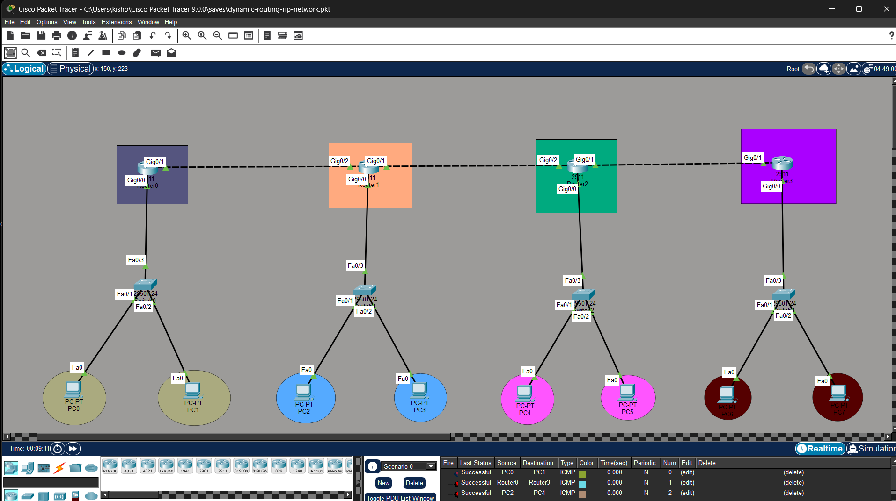

# 🔁 CCNA Dynamic Routing (RIP) Lab

## 📌 Overview

This project demonstrates the implementation of the Routing Information Protocol (RIP) in a multi-router network using Cisco Packet Tracer. It enables dynamic routing between different networks and ensures communication across routers by exchanging routing information automatically.

---

## 🎯 Objectives

* Configure RIP dynamic routing protocol
* Enable communication between multiple routers
* Assign IP addressing to all devices
* Verify routing tables and connectivity
* Test end-to-end communication using ping

---

## 🧩 Key Features

* Multi-router topology
* Dynamic route exchange using RIP
* Automatic network discovery
* Scalable routing configuration
* Connectivity testing across networks

---

## 🛠️ Tools Used

* Cisco Packet Tracer
* Routing & Switching concepts

---

## 🌐 Network Topology



---

## ⚙️ Configuration (Sample)

### 🔹 Enable RIP on Router

```
enable
configure terminal

router rip
version 2
no auto-summary
network 192.168.1.0
network 192.168.2.0

end
write memory
```

---

## 📂 Project Structure

ccna-dynamic-routing-rip-lab/
│── topology/
│── configs/
│── README.md

---

## 📊 Verification Commands

```
show ip route
show ip protocols
ping <destination-ip>
```

---

## 📊 Learning Outcomes

* Understanding dynamic routing concepts
* Hands-on RIP configuration
* Routing table analysis
* Network troubleshooting skills

---

## 📢 Conclusion

This project demonstrates how RIP enables routers to share routing information dynamically, ensuring efficient communication between multiple networks.
